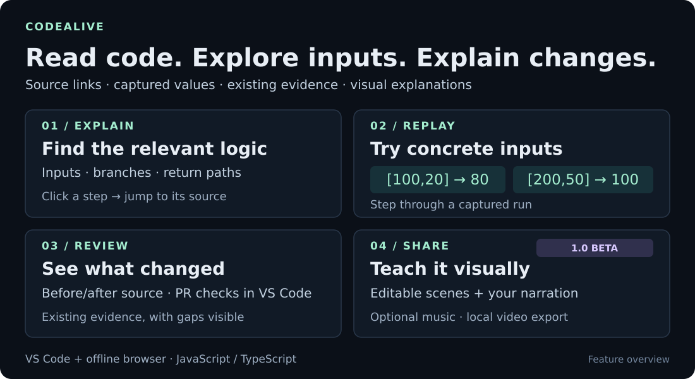

# CodeAlive

**Understand a function, explore its inputs, and explain what changed.**

A local developer tool for JavaScript/TypeScript in **VS Code** and an **offline browser**. Music, sorting demonstrations and video help you share what you learned.

[Download 1.0 beta](https://github.com/bvs1006/CodeAlive/releases/tag/v1.0.0) · [Try it](#try-it-in-two-minutes) · [Feature guides](#go-deeper) · [Roadmap](docs/ROADMAP.md)

## Why use it?

| Your task | How CodeAlive helps |
|---|---|
| Read an unfamiliar function | Follow its inputs, branches and returns; click a step to find the exact source. |
| Investigate an input case | Run the supported subset with JSON arguments, inspect captured values and compare two runs. |
| Review a change | Compare Before/After logic or HEAD against unsaved edits; inspect existing PR checks alongside source changes. |
| Teach or explain an algorithm | Step through sorting, compare operation counts, or build editable explanation scenes with your narration and optional music. |

## See it move

*Actual sorting traces from the bundled implementations. This documentation animation is silent; counts describe this input, not a CPU benchmark.*

See the real code-explanation screen and flow diagram

Browser capture of the original 0.6 explainer. The 1.0 beta adds shared navigation and explanation videos. [Open full size](docs/media/explainer-preview.png).

## Try it in two minutes

1. Download the [1.0 VSIX](https://github.com/bvs1006/CodeAlive/releases/download/v1.0.0/codealive-1.0.0.vsix) and install it through **Extensions → … → Install from VSIX…**. Reload VS Code after upgrading.
2. Select a complete JavaScript/TypeScript function and run **CodeAlive: Explain Selected Code** (`Cmd/Ctrl+Shift+P`). **CodeAlive: Open CodeAlive** provides navigation between workflows.
3. Click a step to reveal its source. Under Replay, enter arguments and choose **Run with these inputs**.

With the built-in **A simple discount** example:

| Arguments | Replay result |
|---|---|
| `[100,20]` | `80` |
| `[200,50]` | `100` |

Pin the first run to compare its result with the second. Use **CodeAlive: Explain Working Tree Changes** to compare the active file with committed HEAD.

**Prefer the browser?** Download the [offline ZIP](https://github.com/bvs1006/CodeAlive/releases/download/v1.0.0/codealive-explainer-1.0.0.zip), extract it and open `browser/explain.html`. GitHub PR review is a VS Code feature.

Desktop VS Code 1.90+, trusted workspace, up to 50,000 source characters. Local explanation/replay needs no CodeAlive account or API key.

## What is available?

| Version | Status and features |
|---|---|
| **1.0 beta** | [Published](https://github.com/bvs1006/CodeAlive/releases/tag/v1.0.0): explanations, bounded replay, change comparisons, PR evidence, shared navigation, music/sorting and editable explanation videos with imported narration. [All release checks passed](https://github.com/bvs1006/CodeAlive/actions/runs/37646131724). |
| **0.8 prerelease** | [Earlier release](https://github.com/bvs1006/CodeAlive/releases/tag/v0.8.0), before shared navigation and narrated explanation videos. |

CI covers platform unit checks, Chromium/media integration and installed Linux VS Code. Windows/macOS desktop, physical audio, private signed-in PRs and assistive-technology checks remain pending.

Explanations are static. Replay supports a restricted synchronous subset. PR checks and structural observations help you review evidence; they do not establish correctness or merge readiness. [Supported behavior and limits](docs/KNOWN_LIMITATIONS.md).

## Go deeper

| Learn | Build and contribute |
|---|---|
| [Explain code](docs/EXPLAIN_CODE.md) · [Replay inputs](docs/EXECUTION_REPLAY.md) | [Developer setup and architecture](docs/DEVELOPMENT.md) |
| [Compare changes](docs/CHANGE_EXPLANATIONS.md) · [Review PR evidence](docs/PR_COMPANION.md) | [Contributing](CONTRIBUTING.md) · [Roadmap](docs/ROADMAP.md) |
| [Explanation videos](docs/EXPLANATION_VIDEO.md) · [Examples](examples/README.md) · [Getting started](docs/GETTING_STARTED.md) | [Report a bug](https://github.com/bvs1006/CodeAlive/issues/new?template=bug_report.yml) · [Ask a question](https://github.com/bvs1006/CodeAlive/issues/new?template=question.yml) |

Explanation/replay source stays local. PR review reads GitHub through the extension host. Review exported captions, source and audio before sharing. No open-source license has been selected (`UNLICENSED`); Marketplace/Open VSX distribution remains pending.
