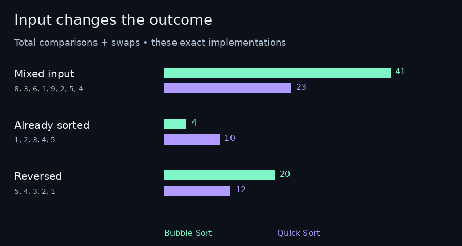

# CodeAlive — PR Companion & Code Visualization

**Inspect GitHub PR changes and CI evidence in VS Code—or turn code and algorithms into audiovisual performances.**

CodeAlive is a creative coding studio for making short performances from your code. Paste a sample in the browser or load a file/selection in VS Code, choose a sound, and record a vertical video with audio.

**Current version: VS Code Video Studio 0.5.0 alpha.** Code soundtrack mode maps text structure to music. Live sorting mode runs built-in Bubble Sort and Quick Sort on a list of numbers. Your editor code is never executed.

[Download the installer](https://github.com/bvs1006/CodeAlive/raw/refs/heads/main/downloads/codealive-pr-companion-0.5.0.zip) · [Installation & usage](docs/GETTING_STARTED.md) · [Ask a question](https://github.com/bvs1006/CodeAlive/issues/new?template=question.yml) · [Report a bug](https://github.com/bvs1006/CodeAlive/issues/new?template=bug_report.yml)

## Review a GitHub pull request

After installation, run **CodeAlive: Review GitHub PR** and paste `https://github.com/owner/repo/pull/123` for a real PR.

- Public PRs can use anonymous access; private PRs need VS Code GitHub sign-in.
- See changed files grouped into source, tests, dependencies, documentation and configuration.
- Inspect checks for the PR head and, when available, GitHub’s test-merge commit.
- See the first reported failure, its available summary, and file/line annotations.
- Use evidence links to open the PR or check details on GitHub.
- Review filename-based prompts separately from verified check results.

**This is read-only evidence inspection, not a new validator.** It never checks out or executes PR code, modifies files, posts comments, reruns CI or approves merges. Required-check coverage is not verified; all displayed checks passing is not proof a PR is merge-ready. Missing, skipped, inaccessible, truncated or changing evidence is shown explicitly. It does not generate AI explanations or patches.

[PR companion guide](docs/PR_COMPANION.md)

## See the creative studio in motion


[View the final frame as a still image](docs/media/comparison-preview.png).

*Silent preview generated from CodeAlive’s real built-in sorting traces with a documentation renderer. It is not a VS Code screenshot or a recording from the extension. Install the extension to hear the synchronized sounds.*

## Pick your first experience

| You want to… | Choose | What happens |
|---|---|---|
| Inspect a GitHub PR | Command: Review GitHub PR | Read change summaries and existing CI evidence without running code. |
| Hear your own code | Code soundtrack | Text structure becomes melody, rhythm and animation; your code is not executed. |
| Learn sorting step by step | Live sorting algorithm | A bundled Bubble Sort or Quick Sort runs on your numbers with comparisons, swaps and pivots. |
| Compare two algorithms | Bubble vs Quick comparison | Both sort the same numbers at equal comparison/swap ticks, with separate counters. |
| Make a developer short | Record video | Save a vertical clip with audio, captions and branding; upload it yourself. |

**Try this first:** install → Open Studio → **Performance: Bubble vs Quick comparison** → enter `8, 3, 6, 1, 9, 2, 5, 4` → **Make it alive**. No code file is needed for this demo.

## Install in VS Code

1. Download and extract the ZIP above.
2. In VS Code, choose **Extensions → … → Install from VSIX…** and select `codealive-0.5.0.vsix`.
3. When upgrading, close existing studio tabs and run **Developer: Reload Window**.
4. Open a code file and run **CodeAlive: Open Studio** from the Command Palette.
5. Click **Load editor file**, or select a smaller section and run **CodeAlive: Load Selection**. Confirm **Loaded: your filename** appears.
6. Choose a style and click **Make it alive**.

Requires desktop VS Code 1.90+, a trusted workspace, and code input of at most 50,000 characters. No Marketplace account or CodeAlive account is required for this local alpha.

## Samples you can copy

| Sample input | Bubble operations | Quick operations | What to look for |
|---|---:|---:|---|
| `8, 3, 6, 1, 9, 2, 5, 4` | 41 | 23 | Quick Sort finishes in fewer operation ticks. |
| `1, 2, 3, 4, 5` | 4 | 10 | Bubble Sort’s early exit helps on an already sorted list. |
| `5, 4, 3, 2, 1` | 20 | 12 | Swapping costs change the totals. |



An operation is one comparison or swap. These counts apply to the bundled implementations: early-exit Bubble Sort and last-element-pivot Quick Sort. They are not CPU timings or a universal ranking.

For code soundtracks, try the [JavaScript](examples/javascript.js), [Python](examples/python.py), [Terraform](examples/terraform.tf) or [Kubernetes YAML](examples/kubernetes.yaml) samples. Paste them into CodeAlive; they are sonification inputs, not deployment or standalone execution instructions. See the [sample guide](examples/README.md) for video hooks and expected behavior.

## Create a video

- Choose **Code Soundtrack**, **Algorithm Performance**, or **Project Showcase**.
- Customize opening, middle and closing captions, plus the title and creator name.
- Enable **Hide source** when you don't want the code visible in the recording.
- Choose 15, 20 or 30 seconds and click **Record video**.
- Preview the clip and choose **Save video** or **Save as MP4**.

Output is vertical 1080 × 1920 at 30 fps with synthesized audio. Native MP4 depends on the embedded browser. WebM-to-MP4 conversion requires FFmpeg installed locally with H.264/AAC support; the original recording remains available if conversion fails. Videos are not uploaded automatically.

## Features

- Three musical styles: Ambient Cloud, Night Drive and 8-bit Arcade.
- Layered melody, chords, bass and percussion with intro, buildup, peak and ending.
- Code-linked animation, musical event nodes and audio-reactive bars.
- Active-file and selection loading, plus optional editor following.
- Timed captions, branding and source hiding.
- Local video presets that exclude your source code.

Python and Terraform/HCL receive their own mapping; YAML uses Kubernetes mapping. JavaScript/TypeScript and other languages use the JavaScript text mapping. Algorithm Performance is inspired by code structure, not actual algorithm execution.

## Live sorting performance

In the studio choose **Performance → Live sorting algorithm**. Select Bubble Sort or Quick Sort and enter 3–18 whole numbers from 1–99.

**Make it alive** runs a preview with highlighted comparisons, swaps and pivots, counters and synchronized tones. Choose a preview speed, then use **Pause**, **Step**, **Resume** and **Reset** to inspect it.

**Record video** fits the complete operation trace into the chosen 15–30 seconds, including opening and sorted-result scenes. Pause/Step are disabled during recording. Use your existing title, creator name and opening/closing captions, then save the recording.

These are actual executions of the two bundled algorithms. They do not run arbitrary selected source code. The older Algorithm Performance video template in code soundtrack mode remains structure-inspired.

## Bubble Sort vs Quick Sort videos

Choose **Performance → Bubble vs Quick comparison**. Enter a list, then play or record. The two panels share the exact same input and advance at the same comparison/swap rate. Each has its own counters; the first to finish holds its sorted result while the other continues. Distinct pitches and stereo positioning distinguish the algorithms when supported.

The result says which used fewer operations **on this input**. This is an operation-count illustration, not a machine-time benchmark. Comparisons and swaps each count as one operation; pivot/partition annotations do not consume extra ticks. Both implementations and their counters are visible in the source. Quick Sort uses a last-element pivot; Bubble Sort exits early when a pass makes no swaps. Try sorted input as well as reversed input to see why input and implementation matter.

Use Pause/Step/Resume for previews. Record fits the whole shared timeline into 15–30 seconds. Titles, creator name and opening/closing captions are included.

## Browser version

The `web/` folder contains the earlier standalone browser alpha. To test locally:

```sh
python3 -m http.server 8080 --directory web
```

Open http://localhost:8080. The browser alpha has music, visuals and recording; the newer video templates and presets are currently in the VS Code extension. The hosted browser demo is currently private and is not advertised as a public launch link.

## Reach out

Use [GitHub Issues](https://github.com/bvs1006/CodeAlive/issues/new/choose) for questions, bugs, feature ideas and collaboration proposals. Maintainer: [@bvs1006](https://github.com/bvs1006). No email address or guaranteed response time is published.

Please share a small, sanitized example rather than proprietary code, credentials or personal information. See [support and troubleshooting](SUPPORT.md).

## Development and validation

```sh
cd extension
node test-pr.cjs
node test-pr-panel.cjs
node test-extension.cjs
node test-app.cjs
node test-sorting.cjs
node test-sorting-app.cjs
node test-comparison.cjs
node test-comparison-app.cjs
python3 package.py
```

Node.js and Python 3 are required for local development; no npm installation is needed. Packaging creates `codealive-0.5.0.vsix` in the repository root. See [CONTRIBUTING.md](CONTRIBUTING.md).

Mocked editor/browser tests and a real sample WebM-to-MP4 conversion passed. These do not replace audio/video testing in real VS Code on Windows, macOS and Linux. See [known limitations](docs/KNOWN_LIMITATIONS.md).

## Discoverability

CodeAlive combines **code sonification**, **algorithm visualization**, **sorting algorithm comparison**, **VS Code extension** workflows and **developer video creation**. Useful for creative coding experiments, computer-science demonstrations and educational coding clips.

## Roadmap and licensing

Next areas: better language parsing, additional instrumented algorithms, test/build integrations and batch video creation. These are planned possibilities, not shipped functionality.

No open-source license has been selected. Source is available for inspection; do not assume unrestricted reuse or redistribution rights. Contact the maintainer before commercial reuse or redistribution. VS Code Marketplace and Open VSX listings have not been published.
