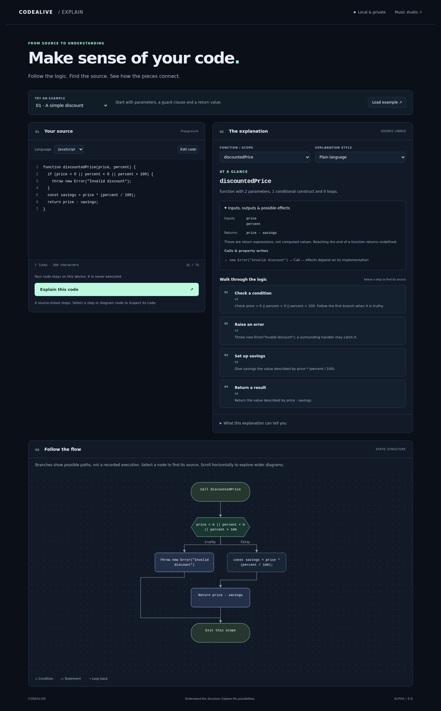
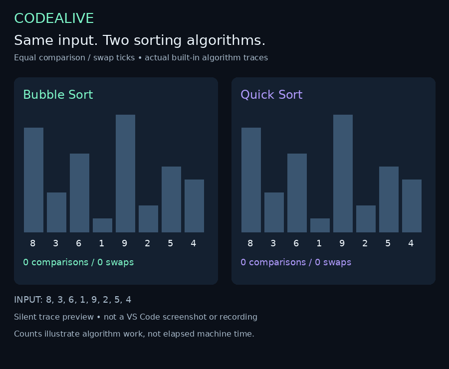

# CodeAlive — understand code, explore its flow, hear its structure

CodeAlive is a developer tool for **source-linked code explanations**, **algorithm visualization**, **code-inspired music and video**, and **GitHub PR evidence review**. Use it to learn an unfamiliar function, demonstrate an algorithm, create an educational clip, or inspect existing CI results.

Start with the workflow you need. The explainer describes JavaScript/TypeScript structure locally; the studio turns text patterns into music; the PR companion reads GitHub evidence.

> **Status — 6 October 2026:** CodeAlive **0.6.0 alpha** includes local code explanations. Release packages are generated after the unit, browser/media and real VS Code checks pass on `main`. Windows/macOS desktop integration and physical audio-device checks remain additional manual validation.

[Download 0.6.0](https://github.com/bvs1006/CodeAlive/releases/download/v0.6.0/codealive-explainer-0.6.0.zip) · [Download 0.5 from main](https://github.com/bvs1006/CodeAlive/raw/refs/heads/main/downloads/codealive-pr-companion-0.5.0.zip) · [Roadmap](docs/ROADMAP.md) · [Ask a question](https://github.com/bvs1006/CodeAlive/issues/new?template=question.yml)

## What can I do today?

| Workflow | What you get | Availability |
|---|---|---|
| Understand a function | Plain-language/developer explanations, parameters, return expressions, calls/property writes, source-linked steps and a static flow diagram | **0.6:** VS Code and offline browser; JavaScript/TypeScript |
| Hear code structure | Three music styles, code-linked visuals and synthesized audio from text patterns | **0.5+:** VS Code and browser studio |
| Explore sorting | Built-in Bubble Sort and Quick Sort, pause/step/resume, operation counts and same-input comparison | **0.5+:** VS Code |
| Create a developer video | Vertical video with audio, captions, branding, source hiding and local presets | **0.5+:** VS Code; browser studio has basic recording |
| Inspect a GitHub PR | Changed-file groups, existing head/test-merge checks and available failure annotations | **0.5+:** VS Code; read-only |

**Current boundaries:** selected source is never executed. Only the two bundled sorting algorithms run on your numbers. The explainer and music studio are connected by an **Explain code** action; synchronized spoken explanations, music and execution replay are still planned. The PR companion does not validate semantic correctness, generate fixes or decide whether to merge.

## Try the explainer in two minutes

### VS Code

1. Download and extract the **0.6 ZIP** above.
2. In desktop VS Code, open **Extensions → … → Install from VSIX…**, then choose `codealive-0.6.0.vsix`.
3. After upgrading, close existing CodeAlive tabs and run **Developer: Reload Window**.
4. Open a JavaScript or TypeScript file, select a complete function, and run **CodeAlive: Explain Selected Code** from the Command Palette. An empty selection loads the active file.
5. Choose the function scope and explanation style. Select a step or diagram node to highlight the code and reveal it in the original editor.

For a demo without your own file, run **CodeAlive: Open Explainer**, load **A simple discount**, and select **Explain this code**. Ten examples cover guards, loops, callbacks, recursion, async code and TypeScript.

Requires desktop VS Code **1.90+**, a trusted workspace and input of at most **50,000 characters**. No CodeAlive account or API key is needed. The Command Palette is `Cmd+Shift+P` on macOS and `Ctrl+Shift+P` on Windows/Linux.

### Browser, without installation

Extract the same ZIP and open **`browser/explain.html`**. The parser, examples and styles are bundled and work offline. Source links highlight code in the browser; navigation into your original file is a VS Code feature.

[Full explainer guide](https://github.com/bvs1006/CodeAlive/blob/main/docs/EXPLAIN_CODE.md)

<details>
<summary>See the actual 0.6 explainer interface</summary>



Captured from the real browser interface in Chromium CI, with the bundled discount example. This is a browser screenshot, not a desktop VS Code screenshot.

</details>

### What an explanation means

```js
function discountedPrice(price, percent) {
  if (price < 0 || percent < 0 || percent > 100) {
    throw new Error("Invalid discount");
  }
  const savings = price * (percent / 100);
  return price - savings;
}
```

CodeAlive identifies two parameters, a conditional branch, an error path, a declaration and a return expression. Selecting a step reveals its exact source range. It does **not** calculate a price, prove the validation is sufficient, or infer the business intent behind the function name.

The diagram describes statement-level structure. Try/catch/finally, switch and labeled blocks are collapsed with warnings; expression-level branches and async suspension remain inside statement nodes. Steps follow source order and can include unreachable code. Explanations are bounded to 100 listed functions, 80 steps, 100 diagram nodes, and 12 return expressions / 12 calls or property writes. Oversized diagrams are omitted with a message.

## Music, sorting and video

Run **CodeAlive: Open Studio**, then **Load editor file** or **CodeAlive: Load Selection**. Confirm the loaded filename, choose Ambient Cloud, Night Drive or 8-bit Arcade, and press **Make it alive**. Soundtracks use shared text-pattern rules across the language choices; Python, Terraform and YAML samples are music inputs, not supported explainer languages.

To explore an actual bundled algorithm, choose **Performance → Live sorting algorithm** or **Bubble vs Quick comparison**. Start with `8, 3, 6, 1, 9, 2, 5, 4`; compare it with sorted and reversed inputs. Each comparison or swap counts as one operation. The result is specific to the input and bundled implementation, not a CPU benchmark.

To make a clip, set captions, title and creator name, choose 15–30 seconds, then **Record video**. Preview it before saving. Output is vertical 1080 × 1920 at 30 fps with audio. Native MP4 availability depends on the browser; WebM-to-MP4 conversion needs local FFmpeg with H.264/AAC support. Uploading remains your choice.

<details>
<summary>Watch the sorting comparison and find sample inputs</summary>



This silent documentation animation uses real bundled sorting traces; it is not a VS Code recording. [Still frame](docs/media/comparison-preview.png) · [Input comparison](docs/media/input-matters.png) · [Sample guide](examples/README.md)

Music samples: [JavaScript](examples/javascript.js), [Python](examples/python.py), [Terraform](examples/terraform.tf), [Kubernetes YAML](examples/kubernetes.yaml).

</details>

## Review GitHub PR evidence

Run **CodeAlive: Review GitHub PR** and paste a URL such as `https://github.com/owner/repo/pull/123` for a real PR. Public PRs can use anonymous reads; private PRs require VS Code GitHub sign-in and repository access.

The panel groups changed files and shows existing checks for the PR head and, when available, the test-merge commit. Missing, pending, inaccessible or truncated evidence is labeled. Filename-based review prompts are heuristic. Required-check coverage and semantic correctness are not verified; green checks alone are not a merge recommendation.

The companion does not check out code, run tests, rerun CI, post comments, modify files or approve a merge. [PR companion details](docs/PR_COMPANION.md)

## Developer quick start

Build from `main`. Prerequisites: Git, **Node.js 22+** with npm, and **Python 3**. Use `python` instead of `python3` where that is your platform's Python 3 command.

```sh
git clone https://github.com/bvs1006/CodeAlive.git
cd CodeAlive
npm ci --ignore-scripts
npm run build
python3 -m http.server 8080 --directory web
```

Open [the explainer](http://localhost:8080/explain.html) or [the music studio](http://localhost:8080/). The standalone browser studio does not include the extension's sorting/comparison modes, newer video templates or presets. There is no public hosted demo link at present.

| Command, from the repository root | Purpose |
|---|---|
| `npm run build` | Generate matching browser/extension explainer assets and bundle the pinned Babel parser plus its license |
| `npm test` | Build assets, run the parser/editor tests and eight existing suites, and check generated-asset equality |
| `npx playwright install chromium` then `npm run test:browser` | Run real Chromium integration checks and create screenshots in `test-results/` |
| `npm run test:vscode` | Install/upgrade the built VSIX and exercise real VS Code; on headless Linux run under `xvfb-run -a` |
| `npm run package` | Build `codealive-0.6.0.vsix` in the repository root; needs `python3` on PATH |
| `python3 scripts/package-release.py` | Build the VSIX plus offline browser ZIP in `downloads/` |

On Linux, Playwright may also need system dependencies: use `npx playwright install --with-deps chromium`. On a system without a `python3` command, use `npm run build` followed by `python extension/package.py` to package with Python 3.

To test in desktop VS Code, install the built VSIX. There is no committed F5 launch configuration. Rebuild and reinstall after changing shared or extension code. [Contribution guide](CONTRIBUTING.md)

### Where the code lives

| Path | Responsibility |
|---|---|
| `shared/explain-engine.js` | Local AST analysis, source ranges, explanations and bounded static flow model |
| `shared/explain-ui.js`, `shared/explain.html`, `shared/explain.css` | Shared browser/webview interface, source highlights, keyboard interaction and diagram rendering |
| `shared/explain-examples.js` | Ten JavaScript/TypeScript examples |
| `extension/explain-panel.js` | VS Code commands, source snapshots, document-version checks and webview bridge |
| `extension/extension.js`, `extension/media/` | Studio host, music, sorting and video workflows |
| `extension/pr-api.js`, `pr-core.js`, `pr-panel.js` | GitHub reads, evidence interpretation and PR panel |
| `web/` | Standalone browser studio and generated explainer entry point |
| `scripts/`, `tests/`, `extension/test-*.cjs` | Shared build, packaging and verification |
| `.github/workflows/ci.yml` | Linux/Windows/macOS unit checks, Chromium integration and installer artifacts |

Edit `shared/`, then build. Generated `web/explainer/` and `extension/media/explainer/` copies are ignored by git and included in packages. Music studio files still have separate browser and extension versions; changes to shared behavior should be checked on both surfaces.

The explainer's analysis stays in the browser/webview. Only source snapshots and validated source-navigation messages pass between the extension host and the explainer. GitHub authentication and PR requests stay in the extension host.

## Verification and known gaps

The [CI workflow](https://github.com/bvs1006/CodeAlive/actions/workflows/ci.yml) runs unit/extension suites on Linux, Windows and macOS, real Chromium/media checks, and an installed-VSIX check in real VS Code on Linux. Browser checks cover all ten examples, source links, keyboard activation, CSP, inert source text, mobile width and code preservation when changing languages. Desktop and mobile browser screenshots were inspected. The Linux editor smoke test passed on VS Code 1.140.0; the workflow records the version on each run.

Unit-level editor and GitHub API tests use mocks; the additional installed-VSIX suite uses real VS Code. Browser media tests verify a playable recording with audio and video tracks. Physical audio-device behavior and actual Windows/macOS editor installations still need manual checks. [Known limitations](docs/KNOWN_LIMITATIONS.md) · [Roadmap](docs/ROADMAP.md)

## Roadmap at a glance

| Order | Milestone | Status |
|---|---|---|
| 1 | Explain selected code with source links and static diagrams | Available in **0.6**; automated release checks included |
| 2 | Replay actual execution with inputs, values and step controls | Planned; initially a constrained, explicitly selected execution/trace workflow |
| 3 | Explain before/after changes and connect them to test/CI evidence | Planned; current PR review only reads existing evidence |
| 4 | Export an explanation with narration, captions and synchronized optional music | Planned; current recordings are studio performances |

Broad adoption also needs a license decision, straightforward distribution, accessibility testing, more explanation languages and user feedback. These are tracked with acceptance criteria in [the full roadmap](docs/ROADMAP.md); there are no committed delivery dates.

## Privacy, support and licensing

The explainer requires no network access, executes no source and keeps its input in memory. Studio presets exclude code. Recordings can display source unless **Hide source** is enabled. Sharing a soundtrack copies a sample/style link, not your pasted source. The hosted music demo remains private, so recipients may not be able to open that link. The PR companion uses GitHub's API and keeps authentication tokens out of the webview.

[Ask a question](https://github.com/bvs1006/CodeAlive/issues/new?template=question.yml) · [Report a bug](https://github.com/bvs1006/CodeAlive/issues/new?template=bug_report.yml) · [Request a feature](https://github.com/bvs1006/CodeAlive/issues/new?template=feature_request.yml) · [Troubleshooting](SUPPORT.md)

For bug reports, include your CodeAlive/VS Code version, OS, workflow, expected result and a small sanitized reproduction. Maintainer: [@bvs1006](https://github.com/bvs1006).

**No open-source license has been selected** (`UNLICENSED`). Source visibility does not grant general reuse or redistribution rights; discuss terms with the maintainer. The bundled Babel parser retains its MIT license. Marketplace and Open VSX listings have not been published.
